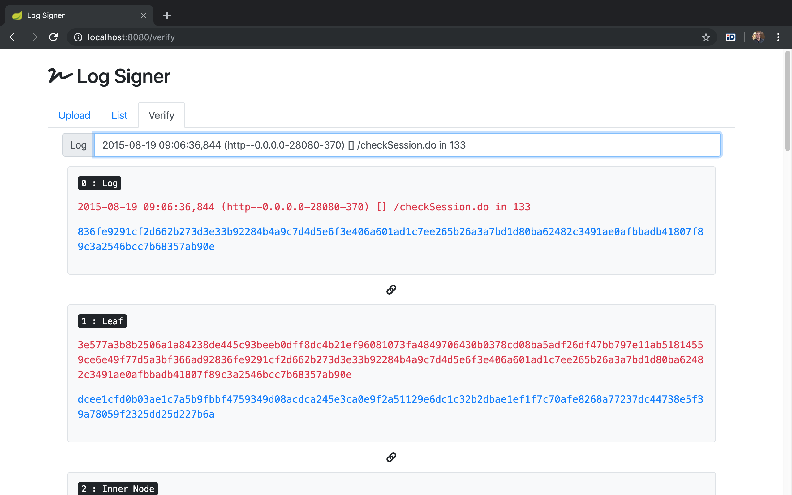

# Log Signer
:lock_with_ink_pen: Log Signer is an project to save log files and to verify log lines later.

#### Features
###### 1. Upload a log file.

###### 2. A sign file is going to be created automatically. (.merkle)

###### 3. You could verify any log line in the log file by viewing merkle path of the log line.

## Introduction
There are several possibilities to sign a log file. One could:
1. Sign the file as a whole
2. Sign each row separately
3. Hash the rows and sign those hashes
4. Hash the rows, chain them and sign the last member of the chain

There is also a *5.* possibility which has some advantages over before mentioned *4*, allowing to prove the integrity of each row and the whole log file at the same time. An additional benefit is the possibility to extract separate rows without exposing the rest of the content. This solution has a name – `hash tree` *(a.k.a. Merkle tree)*.

#### Your task has two parts:
1. **Write a solution for signing any random log file**
    - Input log file is a plaintext file with each event in a separate row. You could use any existing human-readable log file or create your own.
2. **Write a solution for extracting the hash chain for any row from the tree**
    - Input should be the plaintext row for which to extract the hash chain.
    - The output should be the hash chain from the row *(leaf of the tree)* to the single hash representing the whole log file *(the root of the tree)*.

##### You will immediately stumble upon two problems.
1. **Signing:** For the signing of the root hash you can write an empty class or if you have access to the gateway, use our SDK to sign it.
2. **Building the tree:** The picture on top of this page might look easy but the reality is different. In case of balanced tree you would have n2 leaves, but what about those cases where the tree is unbalanced? The solution is up to you.

## License
[MIT](LICENSE)
